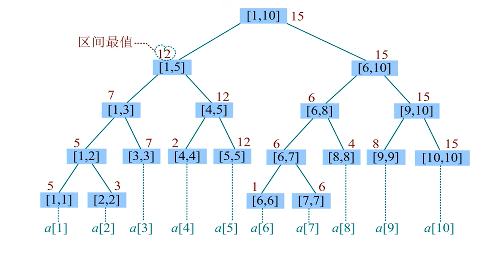

## 0x53 线段树

> 线段树是一种基于**分治**思想的二叉树结构，用于在区间上进行数据统计。
> 线段树的特点：
> 1. 线段树的每个节点都代表一个区间。
> 2. 线段数具有唯一的根节点，代表的区间是整个统计范围。
> 3. 线段树的每个叶节点都代表一个长的为1的元区间 $[x, x]$
> 4. 对于每个内部节点 $[l, r]$，它的左节点是 $[l, mid]$，有节点是 $[mid + 1, r]$，其中 $mid = (l + r) / 2$ （向下取整）。

### 线段树

- **建树**
  - 根节点编号为 $1$。编号为 $u$ 的左子节点编号为 $2u$，右子节点编号为 $2u + 1$ 。
  - 在理想情况下，$N$ 个叶节点的满二叉树有 $\displaystyle N + \frac{N}{2} + \frac{N}{2} + \dots + 2 + 1 = 2N + 1$ 个节点。因为在最后一层产生了空余，所以**保存线段树的长度不要小于 $4N$ 才能保证不会越界**。
    ```C++
    struct Info
    {
        int l, r;   // 左右子节点下标
        int x;
    } tr[4 * N];    // 线段树存储

    void build(int u, int l, int r)
    {
        tr[u].l = l, tr[u].r = r;

        if (l == r)
        {
            tr[u].x = a[r]  // 叶节点
            return;
        }
        int mid = l + r >> 1;
        build(u << 1, l, mid), build(u << 1 | 1, mid + 1, r);
        pushup(u);  // 从下往上传递信息
    }

    build(1, 1, n); // 调用入口
    ```

- **单点修改**
  - 单点修改是一条形如 "$C\ x\ v$" 的指令，表示把 $a[x]$ 修改成 $v$。
  - 在线段树中，根节点是执行各种指令的入口。我们需要从根结点出发。递归找到代表区间 $[x, x]$ 的叶节点，然后从下往上更新 $[x, x]$ 以及它的所有祖先节点上保存的信息。
  - 时间复杂度 $O(logN)$
    ```C++
    void modify(int u, int x, const int& v)
    {
        if (tr[u].l == tr[u].r) // 找到叶节点
        {
            tr[u].x = v;
            return;
        }

        int mid = tr[u].l + tr[u].r >> 1;
        if (x <= mid) modify(u << 1, x, v); // x属于左半区间
        else modify(u << 1 | 1, x, v);      // x属于右半区间
        pushup(u);
    }

    modify(1, x, v);    // 调用入口
    ```

- **区间查询**
  - 区间查询是一条形如 “$Q\ l\ r$” 的指令，例如查询序列 $a$ 在 $[l, r]$ 上的最大值。我们只需从根结点出发，递归执行以下过程。
    - 若 $[l, r]$ 覆盖了当前区间，立即回溯。
    - 若当前区间与 $[l, r]$ 没有交集
      - 当前区间全部在 $[l, r]$ 的左侧，递归访问左子节点。
      - 当前区间全部在 $[l, r]$ 的右侧，递归访问右子节点。
    - 若当前区间与 $[l, r]$ 有交集，分别递归左子节点和右子节点。
    ```C++
    Info rangeQuery(int u, int l, int r)
    {
        if (tr[u].l >= l && tr[u].r <= r) return tr[u];

        int mid = tr[u].l + tr[u].r >> 1;
        if (tr[u].r <= mid) return rangeQuery(u << 1, l, r);
        else if (tr[u].l > mid) return rangeQuery(u << 1 | 1, l, r);
        else
        {
            auto left = rangeQuery(u << 1, l, r);
            auto right = rangeQuery(u << 1 | 1, l, r);
            Info res;
            pushup(res, left, right);
            return res;
        }
    }

    rangeQuery(1, l, r).x;    // 调用入口
    ```



- **代码封装**
```C++ {.line-numbers}
// 求区间最大值
template<class Info, typename T>
struct SegmentTree
{
    const int n;
    vector<Info> tr;
    SegmentTree(int n) : n(n), tr(4 * n) {}
    SegmentTree(const vector<T>& init) : SegmentTree(init.size() - 1)
    {
        function<void(int, int, int)> build = [&](int u, int l, int r)
        {
            if (l == r)
            {
                tr[u].x = init[r];
                return;
            }

            int mid = l + r >> 1;
            build(u << 1, l, mid), build(u << 1 | 1, mid + 1, r);
            pushup(u);
        };
        build(1, 1, n);
    }

    void pushup(Info& u, Info& l, Info& r)
    {
        u.x = max(l.x, r.x);
    }
    void pushup(int u) { pushup(tr[u], tr[u << 1], tr[u << 1 | 1]); }

    void modify(int u, int l, int r, int x, const T &v)
    {
        if (l == r)
        {
            tr[u].x = v;
            return;
        }

        int mid = l + r >> 1;
        if (x <= mid) modify(u << 1, l, mid, x, v);
        else modify(u << 1 | 1, mid + 1, r, x, v);
        pushup(u);
    }
    void modify(int x, const T &v) { modify(1, 1, n, x, v); }

    Info rangeQuery(int u, int l, int r, int x, int y)
    {
        if (l >= x && r <= y) return tr[u];
        
        int mid = l + r >> 1;
        if (y <= mid) return rangeQuery(u << 1, l, mid, x, y);
        else if (x > mid) return rangeQuery(u << 1 | 1, mid + 1, r, x, y);
        else
        {
            auto left = rangeQuery(u << 1, l, mid, x, y);
            auto right = rangeQuery(u << 1 | 1, mid + 1, r, x, y);
            Info res;
            pushup(res, left, right);
            return res;
        }
    }
    Info rangeQuery(int l, int r) { return rangeQuery(1, 1, n, l, r); }
};

struct Info  // 注意long long 和 MLE
{
    int x;
    Node(int v = 0) : x(v) {}
};

SegmentTree<Info, int> seg(n);  // 传大小
SegmentTree<Info, int> seg(a);  // 传数组
```

### 懒标记线段树

&emsp;&emsp;线段树在做单点修改时，时间复杂度为 $O(1)$。但如果用单点修改来进行区间修改，时间复杂度就会变成 $O(r - l + 1)$，试想这个区间长度很大，那么这个时间复杂度是我们不能接受的。

&emsp;&emsp;试想，如果在一次修改指令中发现节点 $p$ 代表的区间 $[p_i,p_r]$ 被修改区间 $[l, r]$ 完全覆盖，并且逐一更新了子树 $p$ 中的所有节点，但是在之后的查询指令中却根本没有用到 $[l, r]$ 的子区间作为候选答案，那么更新 $p$ 的整棵子树就是徒劳的。

&emsp;&emsp;换言之，我们在执行修改指令时，同样可以在 $l \leq p_l \leq p_r \leq r$ 的情况下立即返回，只不过在回溯之前向节点 $p$ 增加一个标记，标识 **“该节点曾经被修改，但其子节点尚未被更新”**。

&emsp;&emsp;也就是说，除了在修改指令中直接划分成的 $O(logN)$ 个节点之外，对任意节点的修改都延迟到 **“在后续操作中递归进入它的父节点时” 再执行**。这样一来每条查询或修改指令的时间复杂度都降低到了 $O(logn)$。这些标记被称为 “懒标记”。懒标记提供了线段树中从上往下传递信息的方式。这种 “延迟” 也是设计算法与解决问题的一个重要思路。


- **代码封装**
```C++ {.line-numbers}
// 求区间和
template<class Info, typename T>
struct LazySegmentTree
{
    const int n;
    vector<Info> tr;
    LazySegmentTree(int n) : n(n), tr(4 * n) {}
    LazySegmentTree(const vector<T>& init) : LazySegmentTree(init.size() - 1)
    {
        function<void(int, int, int)> build = [&](int u, int l, int r)
        {
            if (l == r)
            {
                tr[u].x = init[r];
                return;
            }

            int mid = l + r >> 1;
            build(u << 1, l, mid), build(u << 1 | 1, mid + 1, r);
            pushup(u);
        };
        build(1, 1, n);
    }

    void pushup(Info& u, Info& l, Info& r)
    {
        u.x = l.x + r.x;
        u.len = l.len + r.len;
    }
    void pushup(int u) { pushup(tr[u], tr[u << 1], tr[u << 1 | 1]); }

    void apply(Info& t, const T &tag)
    {
        t.x += tag * t.len;
        t.tag += tag;
    }

    void pushdown(Info& u, Info& l, Info& r)
    {
        apply(l, u.tag);
        apply(r, u.tag);
        u.tag = 0;
    }
    void pushdown(int u) { pushdown(tr[u], tr[u << 1], tr[u << 1 | 1]); }

    void modify(int u, int l, int r, int x, const T &tag)
    {
        if (l == r)
        {
            apply(tr[u], tag);
            return;
        }
    
        pushdown(u);
        int mid = l + r >> 1;
        if (x <= mid) modify(u << 1, l, mid, x, tag);
        else modify(u << 1 | 1, mid + 1, r, x, tag);
        pushup(u);
    }
    void modify(int x, const T &tag) { modify(1, 1, n, x, tag); }

    void rangeApply(int u, int l, int r, int x, int y, const T &tag)
    {
        if (l >= x && r <= y)
        {
            apply(tr[u], tag);
            return;
        }

        pushdown(u);
        int mid = l + r >> 1;
        if (x <= mid) rangeApply(u << 1, l, mid, x, y, tag);
        if (y > mid) rangeApply(u << 1 | 1, mid + 1, r, x, y, tag);
        pushup(u);
    }
    void rangeApply(int l, int r, const T &tag) { rangeApply(1, 1, n, l, r, tag); }

    Info rangeQuery(int u, int l, int r, int x, int y)
    {
        if (l >= x && r <= y) return tr[u];

        pushdown(u);
        int mid = l + r >> 1;
        if (y <= mid) return rangeQuery(u << 1, l, mid, x, y);
        else if (x > mid) return rangeQuery(u << 1 | 1, mid + 1, r, x, y);
        else
        {
            auto left = rangeQuery(u << 1, l, mid, x, y);
            auto right = rangeQuery(u << 1 | 1, mid + 1, r, x, y);
            Info res;
            pushup(res, left, right);
            return res;
        }
    }
    Info rangeQuery(int l, int r) { return rangeQuery(1, 1, n, l, r); }
};

struct Info  // 注意long long 和 MLE
{
    int x;
    int tag, len;   // 懒标记，区间长度
    Info(int v = 0, int c = 1) : x(v), tag(v), len(c) {}
};
```