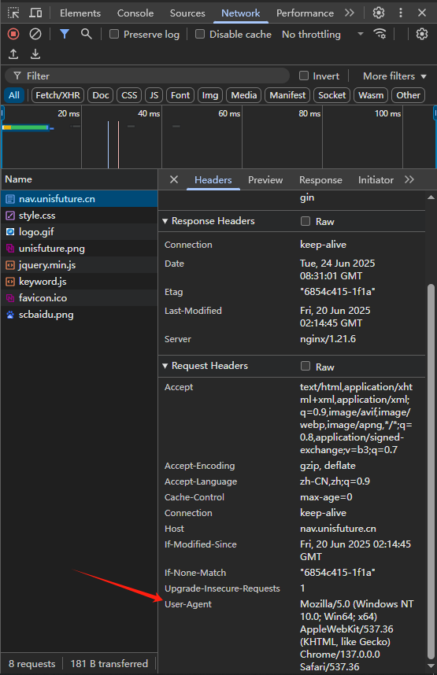
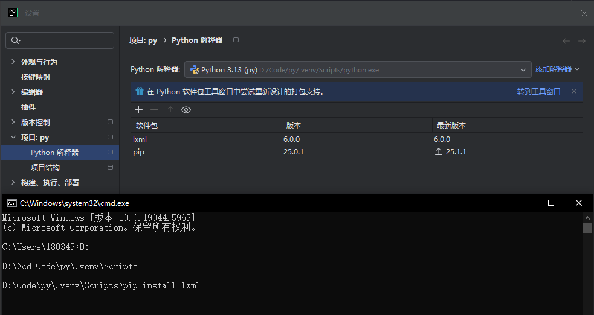
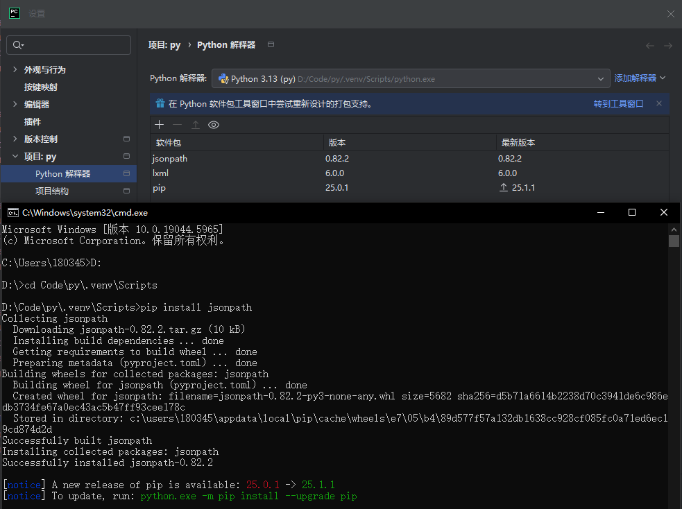

# 0x20 爬虫

## 0x21 $urllib$

### 2.1.1 基本使用

```python
# 使用urllib获取百度首页源码
import urllib.request

# 1. 定义url
url = 'http://www.baidu.com'

# 2. 模拟浏览器向服务器发送请求
response = urllib.request.urlopen(url)
print(type(response))	# <class 'http.client.HTTPResponse'>

# 3. 获取响应中页面的源码
# read()返回的是bytes类型的数据，需要解码
# 二进制 -> 字符串 叫 解码   decode('编码的格式')
content = response.read().decode('utf-8')

# 4. 打印数据
print(content)
```

### 2.1.2 方法

1. `response.read()` 一个字节一个字节地读取
   - `response.read(5)` 读取前5个字节
2. `response.readline()` 读取一行的所有字节
3. `response.readlines()` 按照行读取，读取所有行的字节
4. `response.getcode()` 返回状态码
5. `response.geturl()` 返回url地址
6. `response.getheaders()` 返回状态信息

### 2.1.3 下载

- `urllib.request.urlretrieve(url, filename)`
  - $url$ 代表的是下载的路径
  - $filename$ 是文件名称

### 2.1.4 请求对象的定制

> UA：User Agent，它是一个特殊的字符串头，使得服务器能够识别客户使用的操作系统及版本、CPU类型、浏览器及版本、浏览器内核、浏览器渲染引擎、浏览器语言、浏览器插件等。
>
> **请求对象定制是反爬的一种手段**

```python
headers = {
	'user-agent': 'Mozilla/5.0 (Windows NT 10.0; Win64; x64) AppleWebKit/537.36 (KHTML, like Gecko) Chrome/137.0.0.0 Safari/537.36'
}

# 因为urlopen方法中不能存储字典 所以headers不能传递进去
# 需要请求对象定制
request = urllib.request.Request(url = url, headers = headers)
# 通过重新定义的请求对象访问
response = urllib.request.urlopen(request)
```



> **编码集的演变**
>
> 由于计算机是美国人发明的，因此，最早只有127个字符被编码到计算机里，也就是大小写英文字母、数字和一些符号， 这个编码表被称为 ASCII 编码，比如大写字母 A 的编码是65，小写字母 z 的编码是122。 
>
> 但是要处理中文显然一个字节是不够的，至少需要两个字节，而且还不能和 ASCII 编码冲突， 所以，中国制定了 GB2312 编码，用来把中文编进去。 
>
> 你可以想得到的是，全世界有上百种语言，日本把日文编到 Shift_JIS 里，韩国把韩文编到 Euc‐kr 里， 各国有各国的标准，就会不可避免地出现冲突，结果就是，在多语言混合的文本中，显示出来会有乱码。
>
>  因此，Unicode 应运而生。Unicode 把所有语言都统一到一套编码里，这样就不会再有乱码问题了。
>
>  Unicode 标准也在不断发展，但最常用的是用两个字节表示一个字符（如果要用到非常偏僻的字符，就需要4个字节）。 现代操作系统和大多数编程语言都直接支持 Unicode。

### 2.1.5 编解码

> **Url 编码机制**
>
> Url 只能包含 ASCII 字符集的字符，任何非 ASCII 字符（如汉字）都必须进行编码，否则会导致传输过程中的错误。URL 编码通常使用百分号（%）后跟两位十六进制数来表示字符的 ASCII 码值。

#### $get$ 请求方式

1. `urllib.parse.quote()`

    ```python
    import urllib.request
    import urllib.parse
    
    url = 'https://www.baidu.com/s?wd='
    
    headers = {
        'user-agent': 'Mozilla/5.0 (Windows NT 10.0; Win64; x64) AppleWebKit/537.36 (KHTML, like Gecko) Chrome/137.0.0.0 Safari/537.36'
    }
    
    # url = 'https://www.baidu.com/s?wd=%E5%91%A8%E6%9D%B0%E4%BC%A6'
    url += urllib.parse.quote('周杰伦')
    
    request = urllib.request.Request(url = url, headers = headers)
    response = urllib.request.urlopen(request)
    print(response.read().decode('utf-8'))
    ```

2. `urllib.parse.urlencode()`

    ```python
    import urllib.request
    import urllib.parse
    
    url = 'https://www.baidu.com/s?'
    headers = {
        'user-agent': 'Mozilla/5.0 (Windows NT 10.0; Win64; x64) AppleWebKit/537.36 (KHTML, like Gecko) Chrome/137.0.0.0 Safari/537.36'
    }
    
    data = {
        'wd': '周杰伦',
        'sex': '男',
    }
    
    # urllib.parse.urlencode(data) 将字典转换成字符串
    url += urllib.parse.urlencode(data)
    
    request = urllib.request.Request(url = url, headers = headers)
    response = urllib.request.urlopen(request)
    print(response.read().decode('utf-8'))
    ```

#### $post$ 请求方式

```python
import urllib.request
import urllib.parse

url = 'https://fanyi.baidu.com/sug'
headers = {
    'user-agent': 'Mozilla/5.0 (Windows NT 10.0; Win64; x64) AppleWebKit/537.36 (KHTML, like Gecko) Chrome/137.0.0.0 Safari/537.36'
}

keyword = input('请输入您要查询到单词')
data = {
    'kw': keyword
}

# urllib.parse.urlencode(data) 将字典转换成字符串
# .encode('utf-8') 将字符串转换成字节流
data = urllib.parse.urlencode(data).encode('utf-8')

# HTTP协议要求：HTTP请求的body必须是二进制数据（字节流）
request = urllib.request.Request(url = url, data = data, headers = headers)

response = urllib.request.urlopen(request)
print(response.read().decode('utf-8'))
```

#### $get$ 请求和 $post$ 请求的区别

- get 请求方式的参数必须编码，参数是拼接到 url 后面，编码之后不需要调用 encode 方法
- post 请求方式的参数必须编码，参数是放在请求对象定制的方法中，编码之后需要调用 encode 方法

### 2.1.6 $Ajax$

> $Ajax$ 指的是一种在不刷新整个网页的前提下，与服务器进行异步通信并更新部分网页的技术。

#### $get$ 请求

```python
# 下载豆瓣科幻榜单数据
import urllib.request
import urllib.parse

def main():
    start_page = int(input('请输入起始页码：'))
    end_page = int(input('请输入结束页码：'))

    for page in range(start_page, end_page + 1):
        # 1.请求对象的定制
        request = create_request(page)
        # 2.获取响应数据
        content = get_content(request)
        # 3.下载
        download(page, content)

def create_request(page):
    base_url = 'https://movie.douban.com/j/chart/top_list?type=17&interval_id=100%3A90&action=&'
    headers = {
        'User-Agent': 'Mozilla/5.0 (Windows NT 10.0; Win64; x64) AppleWebKit/537.36 (KHTML, like Gecko) Chrome/137.0.0.0 Safari/537.36'
    }
    data = {
        'start': (page - 1) * 20,
        'limit': 20
    }
    url = base_url + urllib.parse.urlencode(data)
    request = urllib.request.Request(url = url, headers = headers)
    return request

def get_content(request):
    response = urllib.request.urlopen(request)
    return response.read().decode('utf-8')

def download(page, content):
    # with open(文件的名字, 模式, 编码) as fp:
    # fp.write(内容)
    with open('douban_' + str(page) + '.json', 'w', encoding = 'utf-8') as fp:
        fp.write(content)

if __name__ == '__main__':
    main()
```

#### $post$ 请求

```python
# 下载KFC北京地区门店地址
import urllib.request
import urllib.parse

def main():
    start_page = int(input('请输入起始页码：'))
    end_page = int(input('请输入结束页码：'))
    for page in range(start_page, end_page + 1):
        request = create_request(page)
        content = create_content(request)
        download(page, content)

def create_request(page):
    base_url = 'https://www.kfc.com.cn/kfccda/ashx/GetStoreList.ashx?op=cname'
    data = {
        'cname': '北京',
        'pid': '',
        'pageIndex': page,
        'pageSize': '10',
    }
    headers = {
        'User-Agent': 'Mozilla/5.0 (Windows NT 10.0; Win64; x64) AppleWebKit/537.36 (KHTML, like Gecko) Chrome/137.0.0.0 Safari/537.36'
    }

    data = urllib.parse.urlencode(data).encode('utf-8')
    request = urllib.request.Request(url = base_url, data = data, headers = headers)
    return request

def create_content(request):
    response = urllib.request.urlopen(request)
    return response.read().decode('utf-8')

def download(page, content):
    with open('KFC_' + str(page) + '.json', 'w', encoding = 'utf-8') as fp:
        fp.write(content)

if __name__ == '__main__':
    main()
```

### 2.1.7 异常

> 常见异常 $HTTPError$ 和 $URLError$：
> 1. $HTTPError$ 类是 $URLError$ 类的子类
> 2. 导入的包 `urllib.error.HTTPError`、`urllib.error.URLError`
> 3. http 错误：http 错误是针对浏览器无法连接到服务器而增加出来的错误提示。引导并告诉浏览者该页哪里出了问题。
> 4. 通过 urllib 发送请求的时候，有可能会发送失败，这个时候如果想让你的代码更加健壮，可以通过 `try-except` 进行捕获异常，异常有两类，`URLError/HTTPError`

```python
try:
    ...
except urllib.error.HTTPError:
    ...
except urllib.error.URLError:
    ...
```

### 2.1.8 $cookie$

> 适用场景：数据采集的时候，需要绕过登录，然后进入到某个页面
>
> 问题：个人信息页面是 utf-8，但报编码错误？
> 回答：是因为并没有进入到个人信息页面，而是跳转到了登陆页面，登录页面不是 utf-8，所以报错。

```python
headers = {
    # cookie中携带着登录信息，如果有登陆之后的cookie，那么就可以携带着cookie进入到任何页面
    'cookie': '...'
    # 判断当前路径是不是由上个路径进来的，一般情况下是做图片的防盗链
    'referer': 'https://weibo.cn/'
}
```

### 2.1.9 $Handler$ 处理器

> 为什么要学习 handler？
> - `urllib.request.urlopen(url)` 不能定制请求头
> - `urllib.request.Request(url, data, headers)` 可以定制请求头
>   - 动态 cookie 和代理不能使用请求对象的定制
> - `Handler` 定制更高级的请求头

```python
import urllib.request
url = 'https://www.baidu.com'
headers = {
    'User-Agent': 'Mozilla/5.0 (Windows NT 10.0; Win64; x64) AppleWebKit/537.36 (KHTML, like Gecko) Chrome/137.0.0.0 Safari/537.36'
}

request = urllib.request.Request(url = url, headers = headers)

handler = urllib.request.HTTPHandler()
opener = urllib.request.build_opener(handler)
response = opener.open(request)

print(response.read().decode('utf-8'))
```

### 2.1.10 代理服务器

#### 代理的常用功能
- 突破自身 IP 访问限制，访问国外站点。
- 访问一些单位或团体内部资源
   - 某大学 FTP (前提是该代理地址在该资源的允许访问范围之内)，使用教育网内地址段免费代理服务器，就可以用于对教育网开放的各类 FTP 下载上传，以及各类资料查询共享等服务。
- 提高访问速度
   - 通常代理服务器都设置一个较大的硬盘缓冲区，当有外界的信息通过时，同时也将其保存到缓冲区中，当其他用户再访问相同的信息时，则直接由缓冲区中取出信息，传给用户，以提高访问速度。
- 隐藏真实 IP

#### 代码配置代理
- 创建 Reuqest 对象
- 创建 ProxyHandler 对象
- 用 handler 对象创建 opener 对象
- 使用 opener.open 函数发送请求

```python
import urllib.request

url = 'http://www.baidu.com/s?wd=ip'
headers = {
    'User-Agent': 'Mozilla/5.0 (Windows NT 10.0; Win64; x64) AppleWebKit/537.36 (KHTML, like Gecko) Chrome/137.0.0.0 Safari/537.36'
}

request = urllib.request.Request(url = url, headers = headers)

# 代理IP
proxies = { 'http': '202.101.213.83:18925' }

handler = urllib.request.ProxyHandler(proxies = proxies)
opener = urllib.request.build_opener(handler)
response = opener.open(request)

content = response.read().decode('utf-8')
with open('daili.html', 'w', encoding = 'utf-8') as fp:
    fp.write(content)
```

#### 代理池

```python
proxies_pool = [
    { 'http': '118.24.219.151:16817' },
    { 'http': '118.24.219.151:16817' }
]

import random
proxies = random.choice(proxies_pool)
```


## 0x22 解析

### 2.2.1 $xpath$

> 能过帮助我们获取网页中部分数据的方式

#### 安装 & 使用

1. chrome 浏览器安装 XPath Helper 插件

   - `ctrl + shift + x` 快捷键调用

2. 安装 lxml 库

   - 在 `设置 - 项目：xxx - Python解释器` 中查看解释器路径
   - 打开cmd，在解释器路径下输入 `pip install lxml`

   

#### 解析本地文件

- `etree.parse('xx.html')`

#### 服务器响应文件

- `etree.HTML(response.read().decode('utf-8'))`

#### $xpath$ 语法

- `tree.xpath(xpath路径)`

    1. 路径查询
       - `//` 查询所有节点，不考虑层级关系
       - `/` 找直接子节点
    2. 谓词查询
       - `//div[@id]`
       - `//div[@id = 'maincontent']`
    3. 属性查询
       - `//@class`
    4. 模糊查询
       - `//div[contains(@id, "he")]`
       - `//div[starts-with(@id, "he")]`
    5. 内容查询
       - `//div/h1/text()`
    6. 逻辑运算
       - `//div[@id = "head" and @class = "s_down"]`
       - `//title | //price`
    
    ```python
    from lxml import etree
    
    html_tree = etree.parse('test.html')
    # 查找ul下面的li
    li_list = tree.xpath('//body/ul/li')
    # 查找所有有id的属性的li标签
    li_list = tree.xpath('//ul/li[@id]')
    ```
    
    ```python
    from lxml import etree
    import urllib.request
    
    url = 'https://www.baidu.com/'
    headers = {
        'User-Agent': 'Mozilla/5.0 (Windows NT 10.0; Win64; x64) AppleWebKit/537.36 (KHTML, like Gecko) Chrome/137.0.0.0 Safari/537.36'
    }
    
    request = urllib.request.Request(url = url, headers = headers)
    response = urllib.request.urlopen(request)
    content = response.read().decode('utf-8')
    
    html_tree = tree.HTML(content)
    result = html_tree.xpath('//input[@id = "su"]/@value')	# ['百度一下'] xpath返回的是列表
    result = html_tree.xpath('//input[@id = "su"]/@value')[0]	# 百度一下
    ```

#### 案例

站长素材图片抓取并且下载（http://sc.chinaz.com/tupian/shuaigetupian.html）

```python
import urllib.request
from lxml import etree

def main():
    start_page = int(input("Enter start page: "))
    end_page = int(input("Enter end page: "))
    for page in range(start_page, end_page + 1):
        request = create_request(page)
        content = get_content(request)
        download(content)

def create_request(page):
    if page == 1:
        url = 'https://sc.chinaz.com/tupian/fengjing.html'
    else:
        url = 'https://sc.chinaz.com/tupian/fengjing_' + str(page) + '.html'

    headers = {
        'User-Agent': 'Mozilla/5.0 (Windows NT 10.0; Win64; x64) AppleWebKit/537.36 (KHTML, like Gecko) Chrome/138.0.0.0 Safari/537.36'
    }
    return urllib.request.Request(url = url, headers = headers)

def download(content):
    # 下载图片
    tree = etree.HTML(content)
    name_list = tree.xpath('//div[@class = "container"]//img/@alt')
    src_list = tree.xpath('//div[@class = "container"]//img/@data-original')    # src可能会懒加载
    for i in range(len(name_list)):
        name = name_list[i]
        length = len(src_list[i])
        url = 'https:' + src_list[i][:length - 6] + src_list[i][length - 4:]    # 去掉_s，提高清晰度
        urllib.request.urlretrieve(url = url, filename = './images/' + name + '.jpg')

def get_content(request):
    response = urllib.request.urlopen(request)
    return response.read().decode('utf-8')

if __name__ == '__main__':
    main()
```


### 2.2.2 $JSONPath$

> XPath 最初是为 XML 文档设计的，其语法基于 XML 的树状结构（元素、属性、文本节点等）。XPath 无法直接处理 JSON 数据，需先将 JSON 转换为 XML 格式，过程繁琐且可能丢失数据类型（如 JSON 的布尔值、数字在 XML 中会被转为字符串）。
>
> 而 JSONPath 能够直接处理 JSON 数据结构，无需中间转换，解析速度更快。与 XPath 不同，**JsonPath 只能解析本地文件。**
>
> 教程：（http://blog.csdn.net/luxideyao/article/details/77802389）

#### 安装 $jsonpath$ 库

- 在 `设置 - 项目：xxx - Python解释器` 中查看解释器路径
- 打开cmd，在解释器路径下输入 `pip install jsonpath`



#### $JSONPath$ 语法

| XPath | JSONPath           | Description                                                  |
| :---- | :----------------- | :----------------------------------------------------------- |
| /     | $                  | 表示根元素                                                   |
| .     | @                  | 当前元素                                                     |
| /     | . or []            | 子元素                                                       |
| ..    | n/a                | 父元素                                                       |
| //    | ..                 | 递归下降，JSONPath是从E4X借鉴的。所有**子孙节点**。          |
| *     | *                  | 通配符，表示所有的元素                                       |
| @     | n/a                | 属性访问字符                                                 |
| []    | []                 | 子元素操作符                                                 |
| \|    | [,]                | 连接操作符在XPath 结果合并其它结点集合。JSONPath允许name或者数组索引。 |
| n/a   | [start: end: step] | 数组分割操作，从ES4借鉴                                      |
| []    | ?()                | 应用过滤表达式                                               |
| n/a   | ()                 | 脚本表达式，使用在脚本引擎下面。                             |
| ()    | n/a                | XPath分组                                                    |

#### 使用

- `store.json`

    ```json
    {
      "store": {
        "book": [
          {
            "category": "reference",
            "author": "Nigel Rees",
            "title": "Sayings of the Century",
            "price": 8.95
          },
          {
            "category": "fiction",
            "author": "Evelyn Waugh",
            "title": "Sword of Honour",
            "price": 12.99
          },
          {
            "category": "fiction",
            "author": "Herman Melville",
            "title": "Moby Dick",
            "isbn": "0-553-21311-3",
            "price": 8.99
          },
          {
            "category": "fiction",
            "author": "J. R. R. Tolkien",
            "title": "The Lord of the Rings",
            "isbn": "0-395-19395-8",
            "price": 22.99
          }
        ],
        "bicycle": {
          "color": "red",
          "price": 19.95
        }
      }
    }
    ```
    
    | XPath                    | JSONPath                            | 结果                                        |
    | ------------------------ | ----------------------------------- | ------------------------------------------- |
    | `/store/book/author`     | `$.store.book[*].author`            | 店中所有书的作者                            |
    | `//author`               | `$..author`                         | 所有的作者                                  |
    | `/store/*`               | `$.store.*`                         | store 的所有元素，即所有的 books 和 bicycle |
    | `/store//price`          | `$.store..price`                    | store 里面所有东西的 price                  |
    | **`//book[3]`**          | **`$..book[2]`**                    | **第三个书**                                |
    | `//book[last()]`         | `$..book[(@.length - 1)]`           | 最后一本书                                  |
    | `//book[position() < 3]` | `$..book[0, 1]`<br />`$..book[: 2]` | 前面两本书                                  |
    | `//book[isbn]`           | `$..book[?(@.isbn)]`                | 过滤出所有的包含 isbn 的书                  |
    | `//book[price < 10]`     | `$..book[?(@.price < 10)]`          | 过滤出价格低于 10 的书                      |
    | `//*`                    | `$..*`                              | 所有元素                                    |
    
    ```python
    import json
    import jsonpath
    
    # 将json文件中的json数据反序列化为python对象
    obj = json.load(open('store.json', 'r', encoding = 'utf-8'))
    # 使用jsonpath表达式提取json数据中的author字段
    book_list = jsonpath.jsonpath(obj, '$..book[?(@.isbn)]')
    ```

#### 案例

获取淘票票网站中的各城市地点

```python
import urllib.request

url = 'https://www.taopiaopiao.com/cityAction.json?activityId&_ksTS=1751608722576_116&jsoncallback=jsonp117&action=cityAction&n_s=new&event_submit_doGetAllRegion=true'

headers = {
    # ':authority': 'www.taopiaopiao.com',
    # ':method': 'GET',
    # ':path': '/cityAction.json?activityId&_ksTS=1751608722576_116&jsoncallback=jsonp117&action=cityAction&n_s=new&event_submit_doGetAllRegion=true',
    # ':scheme': 'https',
    'accept': 'text/javascript, application/javascript, application/ecmascript, application/x-ecmascript, */*; q=0.01',
    # 'accept-encoding': 'gzip, deflate, br, zstd',
    'accept-language': 'zh-CN,zh;q=0.9',
    'bx-v': '2.5.31',
    'cookie': 'cna=vVbuIIxLilICASeqUJcR4fTB; xlly_s=1; tb_city=110100; tb_cityName="sbG+qQ=="; dnk=; t=3ed647b51989f26b0131b0d329e54ea9; lgc=; sn=; _tb_token_=3895b33b5ebe; cookie2=1cdb70b443da6bbf02fd559ba8a2a370; _nk_=; isg=BIKCeExEXjoFVULmlLYEac8104jkU4ZthhwUesyYQfWgHyOZtOTdfSoZzxtjSf4F',
    'priority': 'u=1, i',
    'referer': 'https://www.taopiaopiao.com/index.htm?spm=a1z21.3046609.header.3.820b112apdSH9K&n_s=new',
    'sec-ch-ua': '"Not)A;Brand";v="8", "Chromium";v="138", "Google Chrome";v="138"',
    'sec-ch-ua-mobile': '?0',
    'sec-ch-ua-platform': '"Windows"',
    'sec-fetch-dest': 'empty',
    'sec-fetch-mode': 'cors',
    'sec-fetch-site': 'same-origin',
    'user-agent': 'Mozilla/5.0 (Windows NT 10.0; Win64; x64) AppleWebKit/537.36 (KHTML, like Gecko) Chrome/138.0.0.0 Safari/537.36',
    'x-requested-with': 'XMLHttpRequest'
}

request = urllib.request.Request(url = url, headers = headers)
response = urllib.request.urlopen(request)
content = response.read().decode('utf-8').split('(')[1].split(')')[0]	# 切割，保留json格式

with open('city.json', 'w', encoding = 'utf-8') as fp:
    fp.write(content)

import json
import jsonpath

obj = json.load(open('city.json', 'r', encoding = 'utf-8'))
city_list = jsonpath.jsonpath(obj, '$.returnValue..regionName')
print(city_list)
```


#### 2.2.3 $BeautifulSoup$

> BeautifulSoup 简称 bs4。和 lxml 一样，BeautifulSoup 是一个 html 解析器，主要功能也是解析和提取数据。
>
> 缺点：效率没有 lxml 的效率高。
> 优点：接口设计人性化，使用方便


